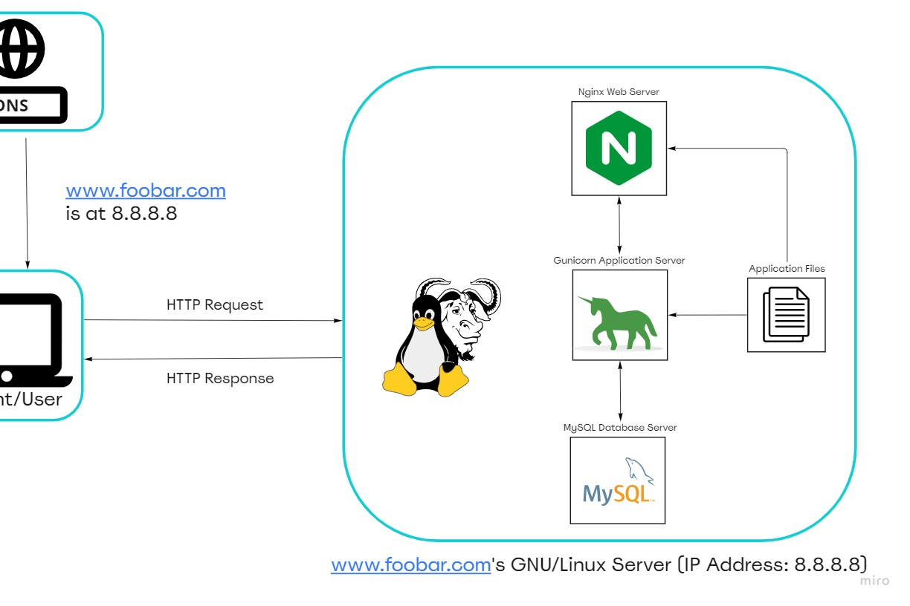

# Simple Web Stack

[Visit Board](https://miro.com/app/board/uXjVPd7wCYw=/)

## Description

This is a simple web infrastructure that hosts a website that is reachable via `www.foobar.com`. There are no firewalls or SSL certificates for protecting the server's network. Each component (database, application server) has to share the resources (CPU, RAM, and SSD) provided by the server.

## Specifics About This Infrastructure

(Use this space to write the specifics about the infrastructure)
## Issues With This Infrastructure
(Use this space to write the specifics about the infrastructure)

