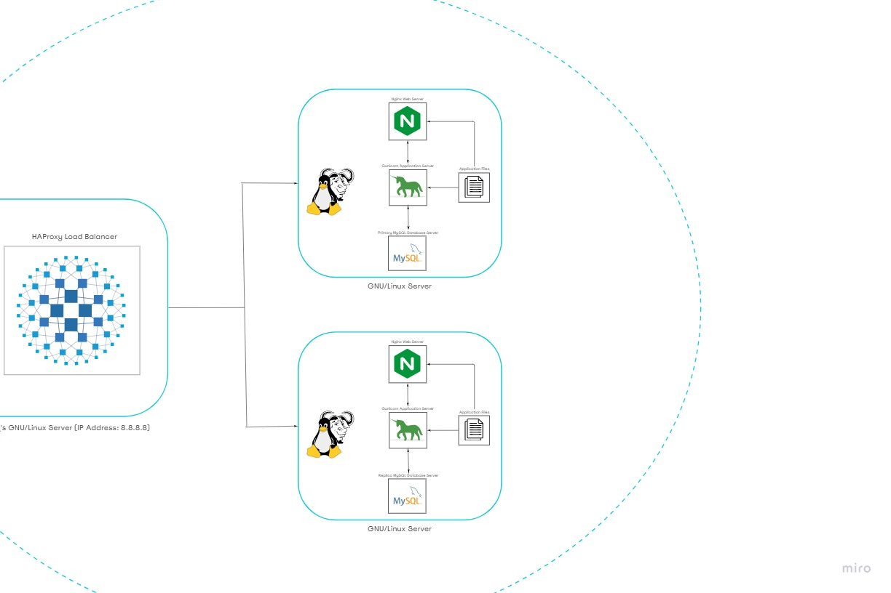

# Distributed Web Infrastructure

[Visit Board](https://miro.com/app/board/uXjVPd7wDlY=/)

## Description

This is a distributed web infrastructure that atttempts to reduce the traffic to the primary server by distributing some of the load to a replica server with the aid of a server responsible for balancing the load between the two servers (primary and replica).

## Specifics About This Infrastructure

(Use this space to write the specifics about the infrastructure)

## Issues With This Infrastructure
(Use this space to write the issues related to the infrastructure)

